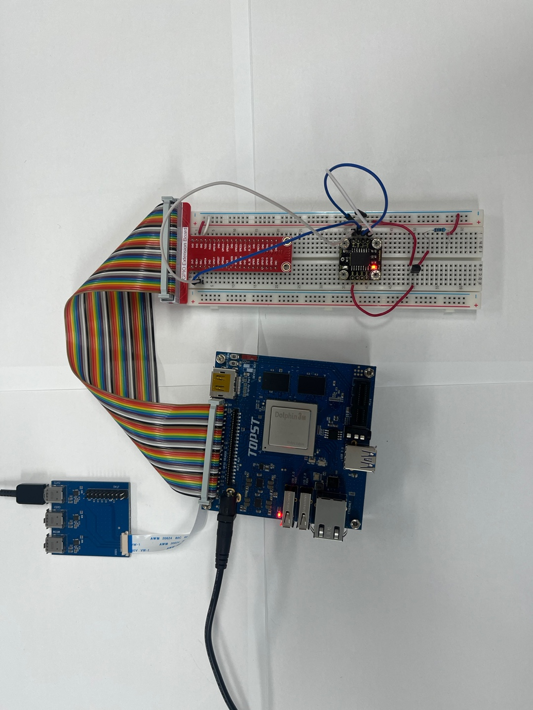
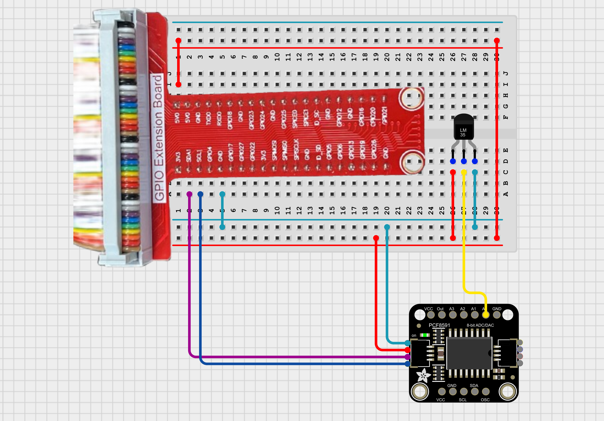
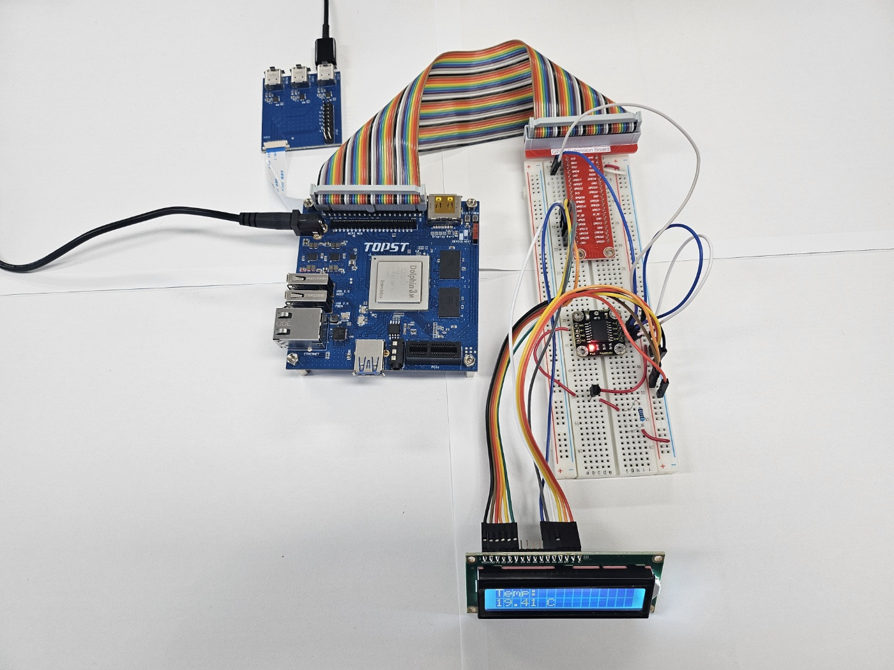
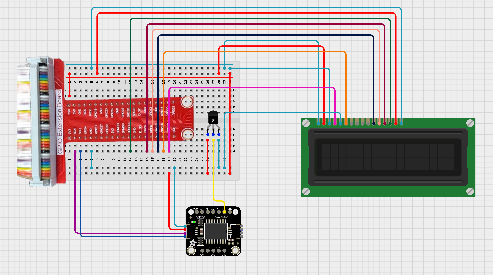
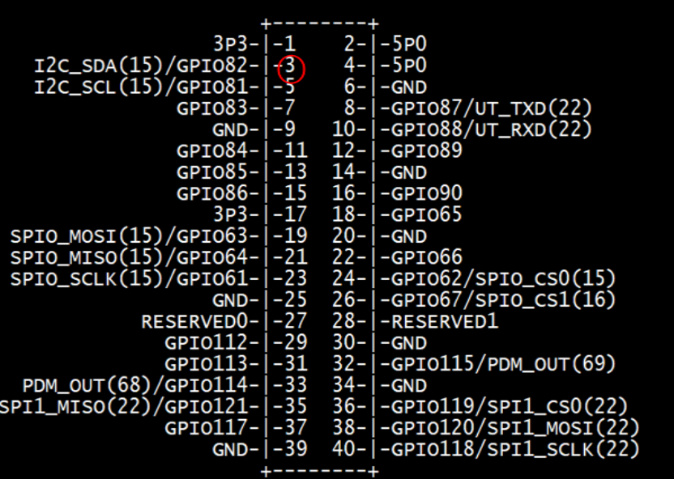

# TOPST D3_ Temperature Sensor

## Introduction

In this document, we'll explore the process of testing and displaying real-time values from a temperature sensor.

**1. Temperature Sensor Operation Test**
    : To perform a functional test of the temperature sensor to ensure it is working correctly and providing accurate readings.

**2. Real-Time Temperature Display**
    : To display real-time temperature readings from the sensor on a display module, providing continuous and up-to-date information.

By following these steps, we will be able to verify the temperature sensor's functionality and visualize the temperature data effectively.
    
There are two ways to write code. <BR>
The **first method** is to write and operate the GPIO code directly **without using libraries**. Use the first method to verify the fundamental operation of the board.<bR> 
The **second method** is to **use libraries**. Libraries allow you to operate components more conveniently<Br>

Additionally,<br>
You can find Library at 00_Base_Library Documentary. When you want to learn more deeply reference them.


## Materials
|DEVICE|MODEL NAME|NUM|
|:------:|:------:|:------:|
|TOPST BOARD|D3|1|
|LCD Display||1|
|GPIO Extention Board||1|
|LM35DZ||1|
|Pcf8591 A/D Converter Module||1|
|WIRE|


## Circuit Picture
**1. only temperature sensor**
<p align="center">

</p>
<p align="center">

</p>
<br>

**2. use a temperature sensor with LCD display**
<p align="center">

</p>
<p align="center">

</p>


### D3 BOARD

|PIN Number|PIN Name|Opponent's PIN|Connect Device|PIN Number|PIN Name|Opponent's PIN|Connect Device|
|:------:|:------:|:------:|------|:------:|:------:|:------:|------|
|VSS|LCD|GND|GPIO BOARD|VDD|LCD|5V|GPIO BOARD|
|VO|LCD|GND|GPIO BOARD|RS|LCD|GPIO117|GPIO BOARD|
|RW|LCD|GND|GPIO BOARD|E|LCD|GPIO121|GPIO BOARD|
|D0|LCD|-|GPIO BOARD|D1LCD|-|GPIO BOARD|
|D2|LCD|-|GPIO BOARD|D3|LCD|-|GPIO BOARD|
|D4|LCD|GPIO114|GPIO BOARD|D5|LCD|GPIO113|GPIO BOARD|
|D6|LCD|GPIO112|GPIO BOARD|D7|LCD|GPIO161|GPIO BOARD|
|+|LCD|5V|GPIO BOARD|-|LED|GND|GPIO BOARD|
|SCL|PCF8591|SCL1|GPIO BOARD|SDA|PCF8591|SDA1|GPIO BOARD|
|data pin(2, middle)|Temperature sensor|AIN0|PCF8591|||||

## GPIO Pin Map
<br>

<p align="center">



<BR>


## 1. Code _ Only Temperature sensor
### Code without using libraries
```python
import smbus
import time


PCF8591_ADDRESS = 0x48  
AIN_CHANNEL = 0  


VREF = 3.3  
TEMP_CONVERSION_FACTOR = 100.0  # 10mV/°C

def read_adc(channel):
    
    if channel < 0 or channel > 3:
        raise ValueError("ADC 채널은 0에서 3 사이여야 합니다.")
    
    bus.write_byte(PCF8591_ADDRESS, 0x40 | channel)
    bus.read_byte(PCF8591_ADDRESS)  
    value = bus.read_byte(PCF8591_ADDRESS)
    return value

def convert_to_temperature(adc_value):

    voltage = (adc_value / 255.0) * VREF
    temperature = voltage * TEMP_CONVERSION_FACTOR
    return temperature
```
- Main code starts here
```python
if __name__ == "__main__":
    bus = smbus.SMBus(1)  

    try:
        while True:
            adc_value = read_adc(AIN_CHANNEL)
            temperature = convert_to_temperature(adc_value)
            print(f"Temperature: {temperature:.2f} °C")
            time.sleep(1)
    except KeyboardInterrupt:
        print("\nMeasurement stopped by User")
    except Exception as e:
        print(f"An error occurred: {e}")
    finally:
        bus.close()
```
<br>

**To run this script, you would use:**

```python
python3 script_name
```
For example:
```python
python3 temperature_sensor.py
```
<Br>
<Br>


### Code When using libraries
- Library
```python
from .. import I2C_Library as i2c

# set i2c bus and device address (default address : 0x48)
def open_device(bus, addr = 0x48):
    fd = i2c.i2c_open(bus)
    i2c.i2c_set_slave(fd, addr)
    return fd

# output : enable output, input : method of get value, auto_increment, channel : analog register number (0~3)
# get control byte for control pcf8591 device
def get_control_byte(output, input, auto_increment, channel):
    control_byte = str(0)
    control_byte = control_byte + str(output)
    control_byte = control_byte + int_to_binary_string(input)
    control_byte = control_byte + str(0)
    control_byte = control_byte + str(auto_increment)
    control_byte = control_byte + int_to_binary_string(channel)

    print(control_byte)
    return int(control_byte, 2)

# make int to binary string
def int_to_binary_string(bit_value):
    binary_string = bin(bit_value)[2:]
    if len(binary_string) == 1:
        binary_string = '0' + binary_string
    return binary_string

# transfer control byte
def write_device(fd, control_byte):
    i2c.i2c_write(fd, control_byte)

# get value from pcf8591
def read_device(fd, control_byte):
    i2c.i2c_write(fd, control_byte)
    while(True):
        data = i2c.i2c_read(fd, 2)[1]
        if(data!= 128):
            break
    return data

# quit i2c communication after using device
def quit_device(fd):
    i2c.i2c_quit(fd)
```
- Controller
```python
from ..Library.Module import PCF8591_Library as pcf
import time

bus = 1
addr = 0x48
channel = 00
auto_increment = 0
input = 0
output = 1

if __name__ == "__main__":
    fd = pcf.open_device(bus, addr) # regist pcf8591 device
    control_byte = pcf.get_control_byte(output, input, auto_increment, channel) # get control byte
    pcf.write_device(fd, control_byte) # transfer control byte
    for i in range(10):
        print(pcf.read_device(fd, control_byte)) # read analog data
        time.sleep(0.05)
    pcf.quit_device(fd) # unregist pcf8591 device
```
**To run this script, you would use:**

Be sure to download script file at **00_Base_Library**.

Location of scripts can cause error.

When you write script yourself, modify **import path**.

```
cd {parent directory path which can include library and controller both}
python3 -m {controller script path}
```

For example:
```
cd TOPST
python3 -m TOPST.Controller.PCF8591_Controller
```


## Result Mov
- Temperature sensor<br>


<br>
<Br>
<br>


## 2. Code _ Temperature sensor with LCD Display
### Code without using libraries
```python

import os
import time

# GPIO path
GPIO_BASE_PATH = "/sys/class/gpio"
GPIO_EXPORT_PATH = os.path.join(GPIO_BASE_PATH, "export")
GPIO_UNEXPORT_PATH = os.path.join(GPIO_BASE_PATH, "unexport")

# GPIO pin control function
def gpio_export(pin):
    if not os.path.exists(os.path.join(GPIO_BASE_PATH, f"gpio{pin}")):
        with open(GPIO_EXPORT_PATH, 'w') as f:
            f.write(str(pin))

def gpio_unexport(pin):
    with open(GPIO_UNEXPORT_PATH, 'w') as f:
        f.write(str(pin))

def gpio_set_direction(pin, direction):
    direction_path = os.path.join(GPIO_BASE_PATH, f"gpio{pin}", "direction")
    with open(direction_path, 'w') as f:
        f.write(direction)

def gpio_write(pin, value):
    value_path = os.path.join(GPIO_BASE_PATH, f"gpio{pin}", "value")
    with open(value_path, 'w') as f:
        f.write(str(value))

def gpio_read(pin):
    value_path = os.path.join(GPIO_BASE_PATH, f"gpio{pin}", "value")
    with open(value_path, 'r') as f:
        return f.read().strip()
```

- Define _ LCD function 
```python
LCD_RS = 117  
LCD_E  = 121  
LCD_D4 = 114  
LCD_D5 = 113   
LCD_D6 = 112   
LCD_D7 = 61  

LCD_WIDTH = 16  
LCD_CHR = "1"
LCD_CMD = "0"

LCD_LINE_1 = 0x80  
LCD_LINE_2 = 0xC0 

E_PULSE = 0.0005
E_DELAY = 0.0005


def lcd_init():
    gpio_export(LCD_E)
    gpio_export(LCD_RS)
    gpio_export(LCD_D4)
    gpio_export(LCD_D5)
    gpio_export(LCD_D6)
    gpio_export(LCD_D7)

    gpio_set_direction(LCD_E, "out")
    gpio_set_direction(LCD_RS, "out")
    gpio_set_direction(LCD_D4, "out")
    gpio_set_direction(LCD_D5, "out")
    gpio_set_direction(LCD_D6, "out")
    gpio_set_direction(LCD_D7, "out")

    lcd_byte(0x33, LCD_CMD)
    lcd_byte(0x32, LCD_CMD)
    lcd_byte(0x28, LCD_CMD)
    lcd_byte(0x0C, LCD_CMD)
    lcd_byte(0x06, LCD_CMD)
    lcd_byte(0x01, LCD_CMD)
    time.sleep(E_DELAY)

def lcd_byte(bits, mode):
    gpio_write(LCD_RS, mode)
    gpio_write(LCD_D4, "0")
    gpio_write(LCD_D5, "0")
    gpio_write(LCD_D6, "0")
    gpio_write(LCD_D7, "0")

    if bits & 0x10 == 0x10:
        gpio_write(LCD_D4, "1")
    if bits & 0x20 == 0x20:
        gpio_write(LCD_D5, "1")
    if bits & 0x40 == 0x40:
        gpio_write(LCD_D6, "1")
    if bits & 0x80 == 0x80:
        gpio_write(LCD_D7, "1")

    lcd_toggle_enable()

    gpio_write(LCD_D4, "0")
    gpio_write(LCD_D5, "0")
    gpio_write(LCD_D6, "0")
    gpio_write(LCD_D7, "0")

    if bits & 0x01 == 0x01:
        gpio_write(LCD_D4, "1")
    if bits & 0x02 == 0x02:
        gpio_write(LCD_D5, "1")
    if bits & 0x04 == 0x04:
        gpio_write(LCD_D6, "1")
    if bits & 0x08 == 0x08:
        gpio_write(LCD_D7, "1")

    lcd_toggle_enable()

def lcd_toggle_enable():
    time.sleep(E_DELAY)
    gpio_write(LCD_E, "1")
    time.sleep(E_PULSE)
    gpio_write(LCD_E, "0")
    time.sleep(E_DELAY)

def lcd_string(message, line):
    message = message.ljust(LCD_WIDTH, " ")
    lcd_byte(line, LCD_CMD)
    for i in range(LCD_WIDTH):
        lcd_byte(ord(message[i]), LCD_CHR)
```

- Main code starts here
```python
if __name__ == "__main__":
    import smbus
    bus = smbus.SMBus(1)  
    PCF8591_ADDRESS = 0x48
    AIN_CHANNEL = 0
    VREF = 3.3
    TEMP_CONVERSION_FACTOR = 100.0

    try:
        lcd_init()
        while True:
            adc_value = read_adc(AIN_CHANNEL)
            temperature = convert_to_temperature(adc_value)
            print(f"Temperature: {temperature:.2f} °C")
            
            
            lcd_string("Temp:", LCD_LINE_1)
            lcd_string(f"{temperature:.2f} C", LCD_LINE_2)

            time.sleep(1)
    except KeyboardInterrupt:
        print("\nMeasurement stopped by User")
    except Exception as e:
        print(f"An error occurred: {e}")
    finally:
        gpio_unexport(LCD_E)
        gpio_unexport(LCD_RS)
        gpio_unexport(LCD_D4)
        gpio_unexport(LCD_D5)
        gpio_unexport(LCD_D6)
        gpio_unexport(LCD_D7)
        bus.close()
```
<br>

**To run this script, you would use:**

```python
python3 script_name
```
For example:
```python
python3 temperature_with_display.py
```
<BR>

## Result Mov
- Temperature sensor with Display<br>


